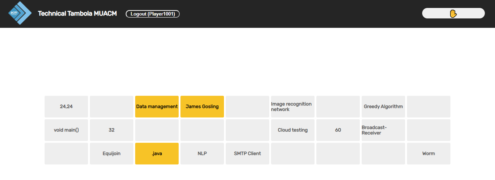

<br/>
<p align="center">

  <h3 align="center">Technical Tambola</h3>

  <p align="center">
    A web-based platform for playing Tambola where players can log in and receive their unique tickets to play Tambola.
    <br/>
    <br/>
    <a href="https://technical-tambola.medicaps.hosting.acm.org/">View Demo</a>
    .
    <a href="https://github.com/Akshat103/Technical_Tambola/issues">Report Bug</a>
    .
    <a href="https://github.com/Akshat103/Technical_Tambola/issues">Request Feature</a>
  </p>
</p>

    

## Table Of Contents

* [About the Project](#about-the-project)
* [Built With](#built-with)
* [Getting Started](#getting-started)
  * [Prerequisites](#prerequisites)
  * [Installation](#installation)
* [Usage](#usage)
* [Contributing](#contributing)
* [Authors](#authors)
* [Acknowledgements](#acknowledgements)

## About The Project



The web-based platform for playing Tambola is a fun and interactive way for players to participate in the game of Tambola. The platform allows players to log in using their unique ID and password, and receive their unique tickets to play Tambola. The user interface is designed to be user-friendly and easy to navigate.

The platform includes features for tracking player progress, such as a hand-raise button to get responses on Google Sheet and marking off answers on the tickets. These features help players to stay engaged and motivated during the game.

The platform is designed to be scalable and can accommodate a large number of players simultaneously. It is also secure and reliable, ensuring that players' information is kept confidential and their gameplay experience is smooth and uninterrupted.

Overall, the web-based platform for playing Tambola is a great way to bring people together and have fun while playing one of the most popular games in India.

## Built With

Client: ReactJS
Server: Node, ExpressJS
Database: MongoDB

## Getting Started

Thank you for your interest in the Technical Tambola. This document will guide you through the steps to get started with the application.

### Prerequisites

Node.js installed on your system (version 14 or above)
MongoDB Atlas account

### Installation

Step 1: Clone the Repository
Open a terminal or command prompt and navigate to the directory where you want to store the project.
Run the command git clone ```  git clone https://github.com/Akshat103/Technical_Tambola``` to clone the repository.

Step 2: Install Dependencies
Navigate into the project backend directory by running ```cd Technical_Tambola/backend```.
Run the command ```npm install``` to install all the required dependencies.
Repeate steps for frontend directory also.

Step 3: Start the Application
Navigate into the project server directory by running ```cd Technical_Tambola/backend```.
Run the command ```npm run start``` to start the application.
Repeate steps for client directory also.
Open a web browser and navigate to http://localhost:3000 to access the application.

Step 4: Use the Application
Log in with an existing account.
| UserID  | Password |
| ------------- | ------------- |
| MUACM1037 | McuTykt8 |
| MUACM1038 | KXwtZ3PJ |

To change the MongoDB connection string in the config/db.js file of the Inventory Management System, follow these steps:

1. Open the project directory in your preferred code editor.
2. Locate the config/config.js file in the project directory.
3. Open the config.js file and find the line of code that specifies the MongoDB connection string.
4. Replace the connection string with your own MongoDB connection string.
5. Save and close the config.js file.

## Usage

During a recent club event at your college, the web-based platform for playing Tambola was used by approximately 100 players. The platform allowed players to log in using their unique ID and password and receive their unique tickets to play Tambola.

As the game progressed, players used the hand-raise button to get responses on Google Sheet and marked off their answers on their tickets. This helped to track their progress and keep them engaged in the game.

The platform was able to accommodate all 100 players simultaneously, providing a seamless and enjoyable gameplay experience. It was also secure and reliable, ensuring that players' information was kept confidential and their gameplay experience was uninterrupted.

Overall, the web-based platform for playing Tambola was a huge success during the club event and provided an exciting and entertaining activity for all participants.

## Contributing

Contributions are what make the open source community such an amazing place to be learn, inspire, and create. Any contributions you make are **greatly appreciated**.
* If you have suggestions for adding or removing projects, feel free to [open an issue](https://github.com/Akshat103/Technical_Tambola/issues/new) to discuss it, or directly create a pull request after you edit the *README.md* file with necessary changes.
* Please make sure you check your spelling and grammar.
* Create individual PR for each suggestion.

### Creating A Pull Request

1. Fork the Project
2. Create your Feature Branch (`git checkout -b feature/Technical_Tambola`)
3. Commit your Changes (`git commit -m 'Add some Technical_Tambola'`)
4. Push to the Branch (`git push origin feature/Technical_Tambola`)
5. Open a Pull Request

## Authors

* **Akshat Tamrakar** - *IT Student* - [Akshat Tamrakar](https://github.com/Akshat103/) - *Built Technical Tambola*

## Acknowledgements

* [Akshat Tamrakar](https://github.com/akshat103/)

